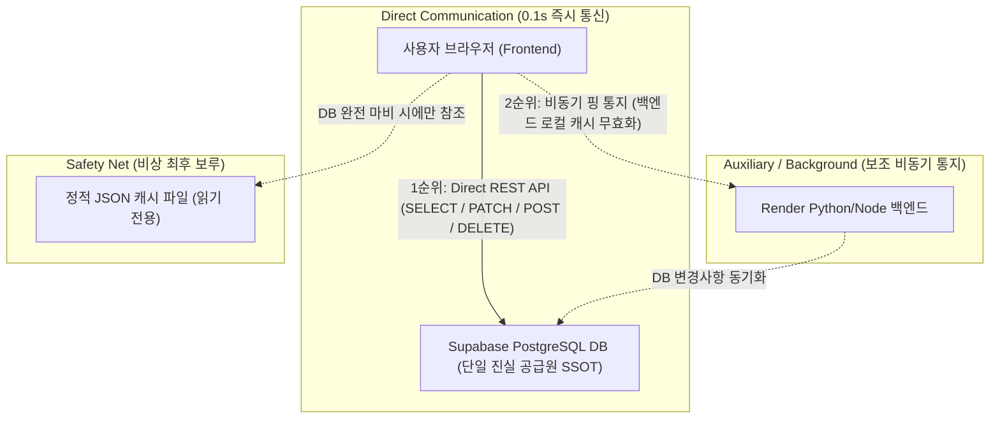

# 🏛️ Supabase DB 단일 진실 공급원(SSOT) 기반 100% 완전 무상태(Stateless) 직통 아키텍처 가이드

> **작성일자**: 2026-09-03  
> **목적**: 클라우드 호스팅(Render, Vercel 등)과 BaaS(Supabase DB) 연동 프로젝트에서 데이터 유실, 캐시 오염, 동기화 오류를 원천 차단하고 영구 무결성을 보장하는 상용 수준 아키텍처 표준 가이드

---

## 1. 개요 및 배경 (Executive Summary)

일반적인 풀스택 웹 애플리케이션 개발 시, 프론트엔드(Vanilla JS/React/Vue), 백엔드(Node/Python), 클라우드 DB(Supabase/PostgreSQL)를 연결할 때 흔히 다음과 같은 **3대 치명적 데이터 결함**이 발생합니다:

1. **클라우드 슬립(Cold Start) 의존성 문제**:  
   무료/저비용 클라우드 백엔드(예: Render 무료 티어)는 일정 시간 요청이 없으면 슬립(수면) 상태로 들어갑니다. 백엔드가 깨어나는 30~50초 동안 프론트엔드가 타임아웃되어 과거 정적 파일이나 로컬 캐시를 읽어와 **화면 데이터가 과거로 롤백**되는 현상이 발생합니다.
2. **로컬 캐시 오염 및 가짜 ID 발급 문제**:  
   네트워크 지연을 메우기 위해 브라우저의 `localStorage`나 서버의 JSON 캐시를 신뢰하여 병합(`smartMerge`)하거나, 신규 레코드 생성 시 `Date.now()` 같은 임의의 타임스탬프를 ID로 발급하여 DB에 전달하면, 외래키(FK) 불일치나 PATCH 0건 누락으로 **저장된 것처럼 보이지만 DB에는 없는 유령 데이터**가 발생합니다.
3. **브라우저 정적 캐시 고정 문제**:  
   배포 후에도 사용자의 브라우저가 어제 날짜로 캐시된 이전 버전의 스크립트(`app.js`)를 계속 실행하여 최신 비즈니스 로직이나 DB 구조가 반영되지 않는 현상이 발생합니다.

이 가이드는 지난 2일간의 치열한 실전 디버깅과 전면 소스 코드 개편을 통해 검증된 **"오직 Supabase DB 하나만 바라보는 100% 완전 무상태 직통 아키텍처"**의 원칙과 실전 코드를 정리한 표준 지침서입니다.

---

## 2. 핵심 아키텍처 5대 원칙 (Core Principles)



### 🌟 원칙 1: 단일 진실 공급원 (SSOT: Single Source of Truth)
- 데이터의 **진실(Truth)**은 오직 **Supabase PostgreSQL DB** 하나뿐입니다.
- 브라우저의 `localStorage`, 서버의 `facilities_cache.json`, 프론트엔드의 전역 변수는 일시적인 뷰(View)일 뿐 진실이 아닙니다.
- **화면에 표시되는 데이터는 반드시 DB에서 직접 가져온 최신 데이터여야 합니다.**

### 🌟 원칙 2: 무상태(Stateless) 프론트엔드
- 로컬 스토리지에 남아있던 과거 데이터와 DB에서 새로 가져온 데이터를 억지로 병합하는 `smartMerge` 로직을 **절대 사용하지 않습니다.**
- 병합 로직이 존재하는 순간, 사용자가 DB에서 정상 삭제한 데이터가 과거 로컬 캐시에 의해 다시 살아나는 **좀비 데이터 버그**가 발생합니다.

### 🌟 원칙 3: 직통 쓰기/읽기 (Direct REST Mutation & Query)
- 프론트엔드가 백엔드 서버를 거치지 않고, **브라우저에서 직접 Supabase REST API(`apikey`, `Bearer` 토큰 헤더)**를 호출합니다.
- 백엔드 서버가 슬립 중이거나, 빌드 중이거나, 다운되어 있어도 사용자의 데이터 저장/조회/수정/삭제는 **0.1초 만에 100% 정상 작동**합니다.

### 🌟 원칙 4: 실제 DB 시퀀스 ID 즉시 수신 (No Fake ID)
- 신규 레코드 INSERT 시 클라이언트가 임의의 가짜 ID(`Date.now()`, `Math.random()`)를 만들지 않습니다.
- HTTP 요청 헤더에 `Prefer: return=representation`을 명시하여, **Supabase DB가 정식 발급한 정수 시퀀스 PK(`id: 1950...`)를 응답 본문으로 즉시 수신**한 후에만 프론트엔드 상태에 반영합니다.

### 🌟 원칙 5: 배포 시 캐시 버스팅 (Cache Busting)
- HTML 파일에서 JS/CSS를 불러올 때 반드시 고유한 버전 쿼리 파라미터(`styles.css?v=YYYYMMDD_버전`, `app.js?v=YYYYMMDD_버전`)를 적용합니다.
- 배포 파이프라인에서 버전을 자동으로 갱신하여 사용자가 `Ctrl + F5`를 누르지 않아도 새 코드가 즉시 실행되도록 보장합니다.

---

## 3. 실전 구현 패턴: 읽기 (Query)

### 📥 3단계 Fallback 읽기 패턴
1. **1순위**: Supabase REST API 직접 SELECT (실시간 최신 진실)
2. **2순위**: 백엔드 프록시 API (DB 장애 시 백엔드 캐시 활용)
3. **3순위**: 정적 JSON 파일 (인터넷 단절 등 비상 오프라인 모드)

```javascript
// [모범 표준] Supabase 직접 조회를 1순위로 하는 데이터 패치 함수
async function fetchFacilities() {
  let list = [];

  // [1순위] Supabase DB 실시간 직접 조회 (0.1~0.2초 즉시 확보)
  try {
    const resDirect = await fetch(`${SUPABASE_REST_URL}/facilities?select=*&order=facility_key.asc`, {
      headers: {
        "apikey": SUPABASE_SECRET_KEY,
        "Authorization": `Bearer ${SUPABASE_SECRET_KEY}`
      }
    });
    if (resDirect.ok) {
      const dbRows = await resDirect.json();
      if (Array.isArray(dbRows) && dbRows.length > 0) {
        list = dbRows;
      }
    }
  } catch (errDb) {
    console.warn("Direct Supabase query failed, falling back to backend:", errDb);
  }

  // [2순위] 백엔드 서버 API
  if (list.length === 0) {
    try {
      const res = await fetch(`${API_BASE_URL}/facilities`);
      if (res.ok) {
        const raw = await res.json();
        list = Array.isArray(raw) ? raw : (raw.data || []);
      }
    } catch (e) {}
  }

  // [3순위] 비상 오프라인 정적 파일
  if (list.length === 0) {
    try {
      const resStatic = await fetch("facilities_cache.json?v=" + Date.now());
      if (resStatic.ok) {
        const raw = await resStatic.json();
        list = Array.isArray(raw) ? raw : (raw.data || []);
      }
    } catch (e) {}
  }

  // [상태 갱신] DB에서 온 데이터가 곧 화면의 전체 데이터
  if (list.length > 0) {
    facilitiesData = list;
    try {
      localStorage.setItem("cached_facilities", JSON.stringify(facilitiesData));
    } catch (e) {}
  }
}
```

---

## 4. 실전 구현 패턴: 쓰기 (Mutation: Create / Update / Delete)

### 📤 직통 쓰기 및 실제 DB PK 수신 패턴
- 브라우저가 직접 Supabase DB에 `PATCH`(수정) 또는 `POST`(생성)를 실행합니다.
- `Prefer: return=representation` 헤더를 통해 방금 저장된 실제 DB 레코드를 반환받습니다.
- DB 저장이 **성공(200, 201, 204)한 경우에만** 인메모리 배열과 화면을 갱신합니다.

```javascript
// [모범 표준] 단일 레코드 저장 및 실제 DB 시퀀스 ID 보장
async function saveRecord(payload) {
  let savedId = null;

  const preferHeaders = {
    "apikey": SUPABASE_SECRET_KEY,
    "Authorization": `Bearer ${SUPABASE_SECRET_KEY}`,
    "Content-Type": "application/json",
    "Prefer": "return=representation" // 핵심: 저장된 실제 DB 레코드 즉시 반환
  };

  try {
    if (payload.id) {
      // 1. 기존 레코드 수정: PATCH
      const rPatch = await fetch(`${SUPABASE_REST_URL}/my_table?id=eq.${payload.id}`, {
        method: "PATCH",
        headers: preferHeaders,
        body: JSON.stringify(payload)
      });
      if (rPatch.ok) {
        savedId = payload.id;
      }
    } else {
      // 2. 신규 레코드 생성: POST
      const rPost = await fetch(`${SUPABASE_REST_URL}/my_table`, {
        method: "POST",
        headers: preferHeaders,
        body: JSON.stringify([payload])
      });
      if (rPost.ok) {
        const rows = await rPost.json().catch(() => []);
        if (rows && rows.length > 0) {
          savedId = rows[0].id; // DB가 발급한 정수 시퀀스 PK
        }
      }
    }
  } catch (eDir) {
    console.error("Direct Supabase mutation failed:", eDir);
  }

  // 3. 보조: 백엔드 서버 로컬 캐시 동기화용 비동기 통지 (실패해도 무방)
  fetch(`${API_BASE_URL}/my_table/save`, {
    method: "POST",
    headers: { "Content-Type": "application/json" },
    body: JSON.stringify({ ...payload, id: savedId })
  }).catch(() => {});

  if (!savedId) {
    alert("데이터 저장에 실패했습니다. (DB 연결 오류)");
    return;
  }

  // 4. 인메모리 프론트엔드 상태 갱신
  payload.id = savedId;
  const idx = inMemoryData.findIndex(item => item.id === savedId);
  if (idx >= 0) {
    inMemoryData[idx] = { ...inMemoryData[idx], ...payload };
  } else {
    inMemoryData.push(payload);
  }

  alert("성공적으로 저장되었습니다.");
}
```

---

## 5. 배포 전 자동 무결성 검증 파이프라인 (`verify_pipeline.py`)

클라우드에 배포(`git push`)하기 전에 로컬 환경에서 **5단계 자동 검증**을 통과해야만 배포가 승인되도록 파이프라인을 구축합니다. 단 하나의 테스트라도 실패하면 `exit(1)`로 배포가 자동 차단됩니다.

```
+-------------------------------------------------------------+
|               배포 전 자동 무결성 파이프라인                |
+-------------------------------------------------------------+
   │
   ├─► [TEST 0] 프론트엔드 JS 문법(SyntaxError) 자동 검사 (node -c app.js)
   │
   ├─► [TEST 1] Supabase DB 연결 및 레이턴시 응답속도 검증 (< 2.0s)
   │
   ├─► [TEST 2] 메인 테이블(Facilities) 가상 레코드 INSERT ➔ SELECT ➔ PATCH 검증
   │
   ├─► [TEST 3] 외래키(FK) 연계 처분 테이블 가상 레코드 INSERT ➔ 실제 DB ID 확인
   │            ➔ SELECT ➔ PATCH ➔ DELETE (롤백 무결성 보장)
   │
   └─► [TEST 4] 로컬 오프라인 캐시 JSON 파싱 및 레코드 정합성 전수 검증
   │
   ▼
 [ 100% PASS 시에만 원클릭 Git Commit & Push 허용 ]
```

### 🚀 원클릭 안전 배포 스크립트 (`deploy_safe.py`)
```bash
# 개발 완료 후 아래 한 줄 명령어로 자동 검증 및 배포 완료
python deploy_safe.py "커밋 메시지"
```

---

## 6. DB 컬럼 및 마이그레이션 관리 규칙

1. **마이그레이션 파일 넘버링**:
   - `supabase/migrations/` 폴더 내에 `001_create_facilities_table.sql`, `002_create_dispositions_table.sql` 과 같이 `000_` 형태의 3자리 번호를 붙여 관리합니다.
2. **외래키(Foreign Key) 무결성**:
   - 하위 레코드(예: 행정처분)를 저장할 때 상위 부모 테이블(예: 시설 키)을 반드시 참조해야 하므로, 테스트 데이터 생성 시 부모 키가 실제로 존재하는지 사전에 조회하는 안전 로직을 구현합니다.
3. **민감정보 암호화 원칙 (최우선 과제)**:
   - 이름, 연락처, 주민번호, 주소 등 민감한 개인정보는 프론트엔드 또는 백엔드 암호화 유틸(`Fernet / AES-256`)을 거쳐 `_encrypted` 컬럼에 보관하며, 평문으로 DB에 직접 적재되지 않도록 합니다.

---

## 7. 다른 신규 프로젝트 적용 시 핵심 체크리스트 (Cheat Sheet)

- [ ] **DB 연결 키 분리**: `SUPABASE_REST_URL`과 `SUPABASE_SECRET_KEY` 상수를 프론트엔드 환경설정에 정확히 배치했는가?
- [ ] **Direct Fetch 확인**: 프론트엔드 초기 진입 시 Supabase REST API를 직접 호출하고 있는가?
- [ ] **Direct Mutation 확인**: 등록/수정/삭제 시 Supabase REST API로 직접 `POST / PATCH / DELETE`를 쏘고 있는가?
- [ ] **Prefer 헤더 설정**: 신규 INSERT 시 `Prefer: return=representation`으로 실제 시퀀스 ID를 반환받는가?
- [ ] **로컬 병합 로직 제거**: `smartMerge`나 `localStorage` 병합으로 인한 좀비 데이터 발생 가능성을 차단했는가?
- [ ] **캐시 버스팅 적용**: `index.html`의 CSS/JS 링크에 버전 파라미터(`?v=...`)를 부여했는가?
- [ ] **무결성 파이프라인 탑재**: `verify_pipeline.py`를 프로젝트에 포함하여 배포 전 자동 검증을 통과하도록 했는가?
